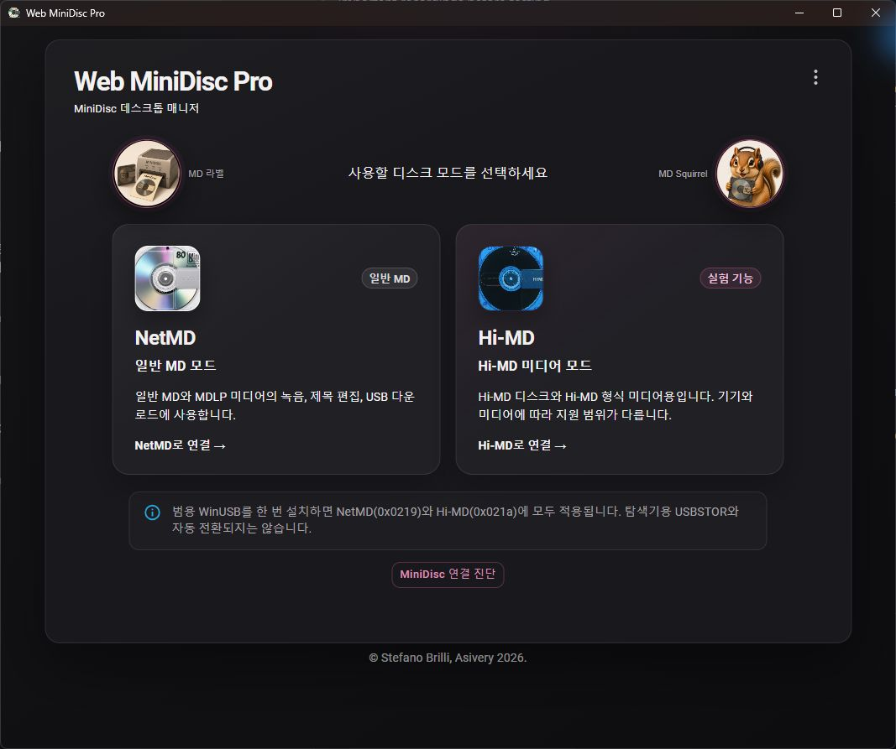
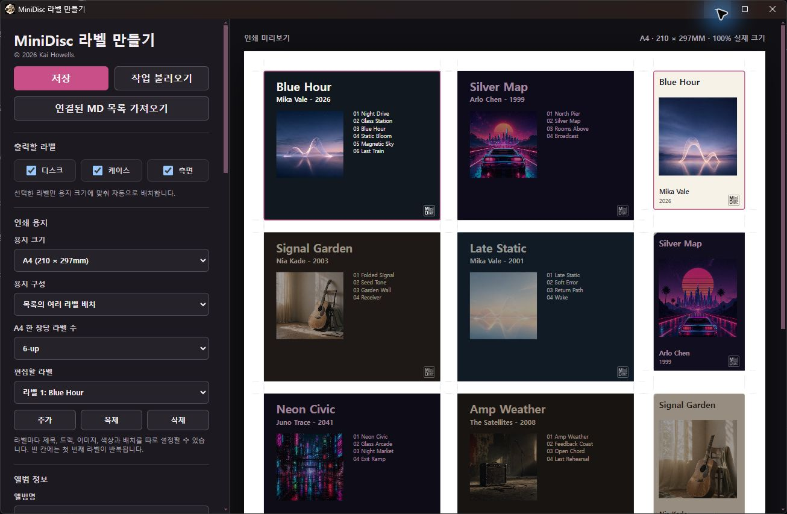

# Web MiniDisc Pro — Windows Custom Build

An unofficial, non-commercial Windows build of
[ElectronWMD](https://github.com/asivery/ElectronWMD) and
[Web MiniDisc Pro](https://github.com/asivery/webminidisc), focused on
NetMD/Hi-MD device support and an integrated WinUSB installation flow.

> This repository is not an official release of ElectronWMD, Web MiniDisc Pro,
> Sony, or MiniDisc.wiki. Back up important recordings before testing.

## Status

The source and GitHub Actions build pipeline are public. Web MiniDisc Pro 1.5.4 — Windows Custom R7 is
available from [GitHub Releases](https://github.com/run240/web-minidisc-pro-windows-custom/releases)
as a portable x64 ZIP. The current portable build is unsigned; open-source
code-signing setup and Windows 11 Smart App Control verification are still in
progress.

Free code signing provided by
[SignPath.io](https://signpath.io/), certificate by
[SignPath Foundation](https://signpath.org/).

## Main changes

- Integrated WinUSB helper based on libwdi 1.5.1
- NetMD and Hi-MD connection and mode diagnostics
- Automatic RH1 NetMD/Hi-MD USB interface switching without replugging
- Automatic mode reconnection after the application restarts
- Multiple connected-device selection
- MiniDisc disc, case, and spine label designer with PDF, PNG, SVG, and project export
- Import the track list already loaded from a connected NetMD or Hi-MD into a label
- Korean UI and filename romanization improvements
- MD Squirrel assistant for creating English-tagged copies of local audio
- Apple Music (US) metadata lookup for English track and artist names, with
  duration-aware candidates and a manual web-search fallback
- Original audio preservation: copies are written to a sibling `[English]`
  folder without re-encoding
- Hi-MD and NetMD temporary metadata editing
- Batched title, album, artist, order, group, and disc-name editing with post-write verification
- Hi-MD connection-state cleanup and safer timeout recovery
- Transfer-stall diagnostics and troubleshooting information
- Windows-focused theme, icons, loading screen, dialogs, and context menus,
  including light-theme text contrast fixes
- Window position and monitor restoration across mode changes

## Screenshots

### Windows home and mode selection



### MiniDisc label maker



## Source layout

- `src/`: ElectronWMD source
- `webminidisc/`: pinned Web MiniDisc Pro submodule
- `third_party/libwdi/`: complete corresponding source for the WinUSB helper
- `custom-overrides/`: exact Windows Custom R7 generated-file modifications and label-maker assets
- `.github/workflows/build-signpath.yml`: Windows build and SignPath submission
- `signpath-artifact-configuration.xml`: Authenticode signing scope

Base revisions:

- ElectronWMD: `a3f30f8ae3bb022aa8aa58776dc7e473c09ad066`
- Web MiniDisc Pro: `30c3045155a1c057171506aaf3ffee64552df679`

The current Windows Custom R7 modifications were originally made against generated output.
They are kept as a transparent build overlay so the existing release can be
reproduced. Future changes should be moved into the TypeScript/React sources
where practical.

The complete reviewed renderer bundle is stored under `custom-overrides/renderer`.
This includes the worker scripts, fonts, WASM files, and image assets required
for offline and GitHub Actions builds.

## Building on Windows

Requirements:

- Node.js 20
- Visual Studio 2022 Build Tools with Desktop development with C++
- Windows 10 or Windows 11 SDK

From an x64 Native Tools Command Prompt:

```powershell
npm ci --legacy-peer-deps
third_party\libwdi\build-wmdp-helper.cmd
npm run pack:custom
```

The unpacked application is written to `build\win-unpacked`.

For the signing workflow and SignPath configuration, see
[PUBLIC-SIGNING.md](PUBLIC-SIGNING.md).

## Code signing policy

The project's code-signing roles, privacy statement, release approval process,
and Windows system-change policy are documented in
[CODE-SIGNING-POLICY.md](CODE-SIGNING-POLICY.md).

Free code signing provided by
[SignPath.io](https://signpath.io/), certificate by
[SignPath Foundation](https://signpath.org/).

## License and credits

ElectronWMD and Web MiniDisc Pro are distributed under the GNU General Public
License version 2. The embedded WinUSB helper is derived from
[libwdi](https://github.com/pbatard/libwdi), licensed under the GNU Lesser
General Public License version 3 or later.

Original work and contributions belong to Stefano Brilli, Asivery, Pete Batard,
and the respective upstream project contributors.

This software is provided without warranty.
